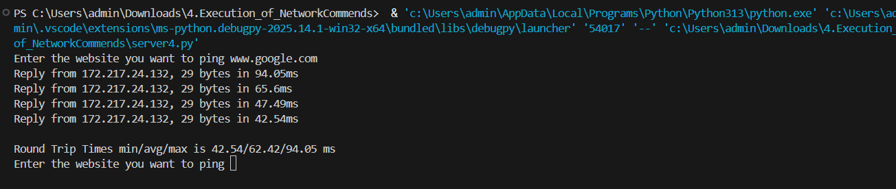

# 4.Execution_of_NetworkCommands
## AIM :Use of Network commands in Real Time environment
## Software : Command Prompt And Network Protocol Analyzer
## Procedure: To do this EXPERIMENT- follows these steps:
<BR>
In this EXPERIMENT- students have to understand basic networking commands e.g cpdump, netstat, ifconfig, nslookup ,traceroute and also Capture ping and traceroute PDUs using a network protocol analyzer 
<BR>
All commands related to Network configuration which includes how to switch to privilege mode
<BR>
and normal mode and how to configure router interface and how to save this configuration to
<BR>
flash memory or permanent memory.
<BR>
This commands includes
<BR>
• Configuring the Router commands
<BR>
• General Commands to configure network
<BR>
• Privileged Mode commands of a router 
<BR>
• Router Processes & Statistics
<BR>
• IP Commands
<BR>
• Other IP Commands e.g. show ip route etc.
<BR>

## Program
## client.py
```
import socket
from pythonping import ping
s=socket.socket() 
s.bind(('localhost', 8000))
s.listen(5)
c, addr = s.accept()
while True:
	hostname = c.recv(1024).decode()
	try:
		c.send(str(ping(hostname, verbose=False)).encode())
	except KeyError:
		c.send("Not Found".encode())

```
## server.py
```
import socket
s = socket.socket()
s.connect(('localhost', 8000))
while True:
	ip = input("Enter the website you want to ping ")
	s.send(ip.encode())
	print(s.recv(1024).decode())

```

## Output

#### netstat

#### ipconfig

#### ping 

#### tracert

#### nslookup

#### getmac

#### hostname 

#### nbtstat

#### arp

#### systeminfo


## Result
Thus Execution of Network commands Performed 
